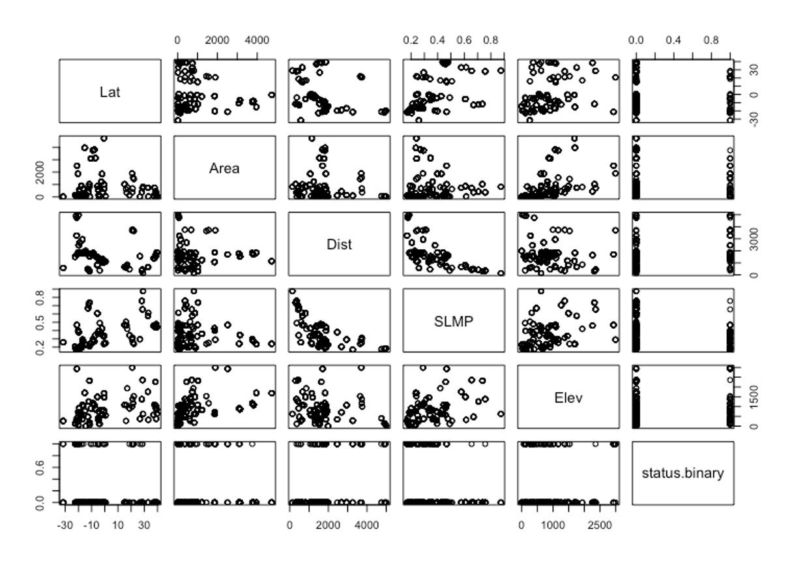
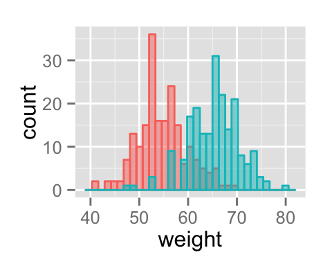

#  After cleaning the data we still do not know what it looks like 

---
#  Data structure 

+ R guesses what type of data is in the columns
+ If wrong, problems with plotting and statistics
+ Check with str()

+ Types: numeric, integer, character, factor

+ Can be corrected

.pull-left[]

.pull-right[]

---
#  Summary statistics 

+ summary()
+ head()
+ tail()
+ mean()
+ median()
+ min()
+ max()
+ sd ()
+ var()
+ cor ()
+ length()

---
#  Scatterplot 

+ Compare two numeric variables

---
#  Scatterplot 

+ Compare all data

+ plot(data)

---
#  Histogram 

+ See distribution of data

+ Check assumptions of tests

+ Transform data if needed

---
#  Boxplot 

+ Histograms on their side

+ Not a statistical test !

---
#  Map 

+ Coordinates needed

---
#  Visualization is not a statistical test ! 

+ Exploring and visualizing the data can help you find patterns and relationships

+ These need to be confirmed with a statistical tests of a hypothesis (e.g. linear regression, t-test, ANOVA)

+ Drawing a line through a scatter plot is not performing a linear regression

+ Good way to check assumptions of statistical tests (e.g. normal distribution)

---
#  Statistical tests 

+ Linear regression
	+ To model the relationship between two variables

+ T-test
	+ To determine whether the means of two groups are equal to each other

+ ANOVA
	+ Compare three or more means

---
#  Explanation video's 

+ Linear regression:
	+ https:// youtu.be /nk2CQITm_eo
	+ https://youtu.be/eTZ4VUZHzxw

+ T-test and ANOVA:
	+ https:// youtu.be /NF5_btOaCig
	+ https:// youtu.be /VNJbX6mr6Uw

---

#  Explore the data by yourself! Use the R script 

