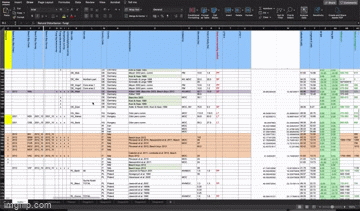
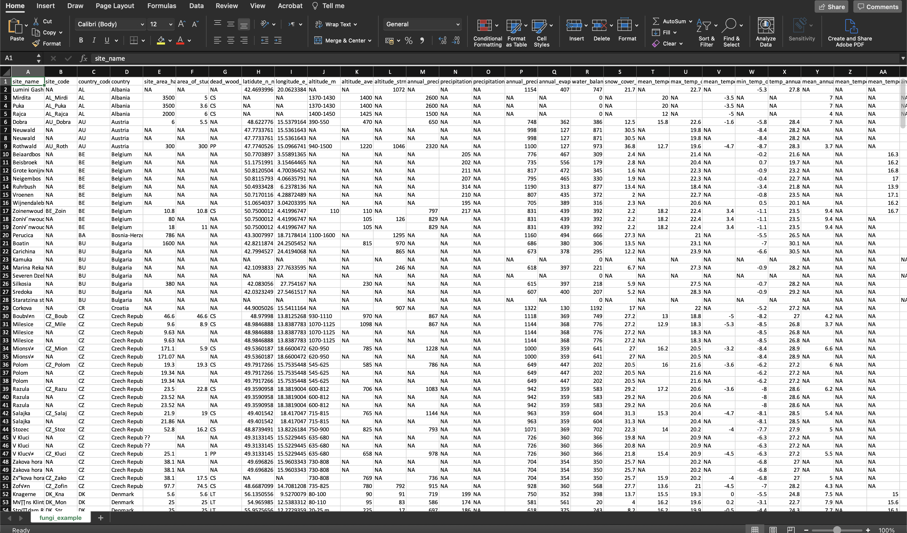

```{r setup, include=FALSE}
options(htmltools.dir.version = FALSE)
library(tidyverse)
library(ggplot2)
library(icon)
```


# Know how sometines your excel looks like this?
.center[

]

---
# So how do we make it into this?

.center[

]

---

# Steps to a clean dataset

0. Building your dataset with R in mind

1. Pre-R cleaning

2. Within R cleaning

---

# Tips to build datasets cleanly

* Give columns short and meaningful names. 

* Create a key that gives more details about the column names

* Create several excel spreadsheets that are linked to each other by one column. Preferably in different files.

* Don't put values in %

* Don't put any characters where no data was collected (e.g. no "." or "-")

* Try to avoid color coding, especially rows

---

# More times on how to build datasets cleanly 

* Don't put unites inside the cells

* If you want to represent a range make two columns - one for each value of the range

* Make sure you fill each column with the same type of data - character/ number

---

class: center, middle

# Pre-R cleaning

Some things are faster in Excel so some cleaning steps can be done before loading the data to R

.center[

]


---

# Some general guidelines

* Before you start, save the file to a new file with a new informative name

* Copy the whole spreadsheet and paste it as values to remove any equations

* Remove all the columns that are not needed for analysis (e.g. references, comments)

* Remove any filtering or splitting settings on the spreadsheet

* If the dataset is relatively small, make sure there are no strings in columns that should be numbers

---

class: center, middle

# Now we are ready for R!

.center[

]

---
class: center, middle

# Let's check useful functions from tidyverse

.center[

]

---

# Recap on tidyverse

* A powerful family of packages that allows you to manipulate and analyze data

* Uses pipe syntax from magrittr (%>%)

---

# First thing - load the data with `reader` package

* `read_csv`

* `read_delim` - remember to add the delimiter

---

class: inverse, middle, center

# Here is a list of some super useful functions 

---

# Classic one's (`dplyr` package)

* `select` - allows you to select or deselect columns

* `filter` - allows you to filter rows by values in some columns

* `mutate` - allows you to change anything, either values within columns or adding new columns with new values

---

# Some simple but useful

* `clean_names` (from `janitor`) - changes all the column names to easy to deal with R format

* `rename` (from `dplyr`)- lets you rename a column, or many columns

* `na_if` (from `dplyr`) - allows you to replace any pattern with NA (a good way of getting rid of annoying characters that you forgot to remove)

* `drop_na` (from `tidyr`)- allows you to remove all the rows with NA

* `relocate` (from `dplyr`) - allows you to relocate columns in the dataset

* `distinct` - Allows to remove duplicated rows or retain unique values in a column
---

# Within data manipulations

* `case_when` (from `dplyr`) - allows you to manipulate the data inside the columns based on conditions. Used inside mutate

* `separate` (from `tidyr`) - allows you to separate a column to multiple columns (similar to "text-to-column" option in excel)

---

# Manipulate data structure

* `pivot_longer` - creates a long format from your dataframe

* `pivot_wider` - creates a wide format from your data

* `group_by` - lets you group the data based on a categorical variable or multiple ones

* `nest` - lets you create a subset of datasets in the same table

* `tally` - allows you to count how many rows you have in a group

* `across` - lets you do operations across multiple columns

---


# To summarize

There are so many ways of using these function that you can discover using google.

There are also many other functions that I haven't touched on

Tidyverse is a very powerful tool that allows you to do a lot of manipulations in within R. All you need is to learn how to plan your manipulations
---

class: middle, center

# Now it's your turn! 

.center[

]
